# Installation et déploiement

Tutoriel permettant de rejouer l'intégralité de l'installation : cluster,
construction des images, déploiement et validation.

---

## 1. Architecture cible

Trois VM Debian 13 (arm64) formant un cluster Docker Swarm.

| Hostname      | Adresse IPv4    | Rôle Swarm |
| ------------- | --------------- | ---------- |
| `swarm-node1` | `192.168.64.17` | Manager    |
| `swarm-node2` | `192.168.64.18` | Worker     |
| `swarm-node3` | `192.168.64.19` | Worker     |

Services déployés :

| Service           | Image                             | Réplicas | Exposition           |
| ----------------- | --------------------------------- | -------: | -------------------- |
| `nginx`           | `nginx:alpine`                    |        2 | `80` et `443` publiés |
| `frontend`        | `ecommerce/frontend:local`        |        3 | interne (`8080`)     |
| `auth-service`    | `ecommerce/auth-service:local`    |        2 | interne (`3001`)     |
| `product-service` | `ecommerce/product-service:local` |        2 | interne (`3000`)     |
| `order-service`   | `ecommerce/order-service:local`   |        2 | interne (`3002`)     |
| `mongodb`         | `mongo:4.4.18`                    |        1 | interne (`27017`)    |

Nginx est le seul point d'entrée public. Il assure la terminaison TLS et
relaie vers le frontend, qui sert le build Vite et proxifie les appels
`/api/*` vers les backends via le réseau overlay `ecommerce_net`.
MongoDB héberge trois bases logiques : `auth`, `products`, `orders`.

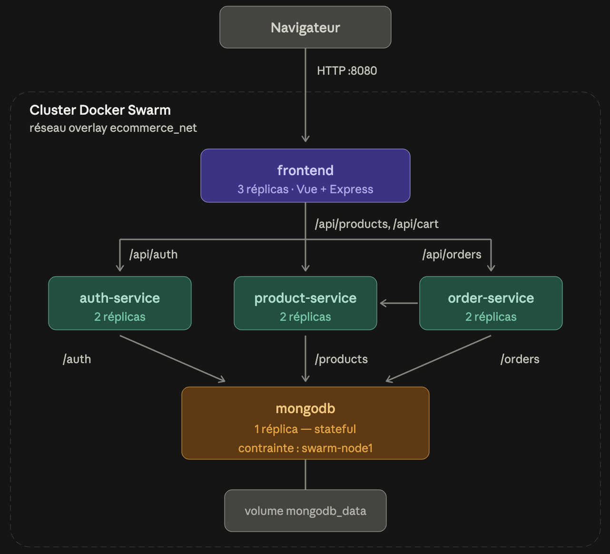

Les réplicas sont répartis automatiquement par Swarm sur les trois nœuds.
Seul `mongodb` est fixé sur `swarm-node1` par contrainte de placement, son
volume étant local au nœud qui l'héberge.

---

## 2. Prérequis

- Trois VM Debian 13 arm64, édition serveur, utilisateur `esgi`
- Docker CE 29.6.1, version identique sur les trois nœuds
- Accès SSH par clé depuis la machine d'administration
- Accès SSH par clé depuis `swarm-node1` vers les deux workers

Vérification :

```bash
for i in 17 18 19; do
  echo -n "192.168.64.$i -> "
  ssh esgi@192.168.64.$i 'hostname && docker --version'
done
```

---

## 3. Configuration réseau des nœuds

Les adresses doivent être statiques. Docker Swarm enregistre l'adresse du
manager lors de l'initialisation : si elle change, le cluster devient
inopérant.

Sur chaque nœud, `/etc/systemd/network/10-enp0s1.network` :

```ini
[Match]
Name=enp0s1

[Network]
Address=192.168.64.17/24
Gateway=192.168.64.1
DNS=192.168.64.1
IPv6AcceptRA=no

[Route]
Destination=192.168.64.0/24
Scope=link
```

Adapter l'adresse par nœud (`.17`, `.18`, `.19`).

La section `[Route]` est indispensable. Sans route de lien explicite vers le
sous-réseau, la passerelle est injoignable et la route par défaut reste
inerte : la machine répond en local mais devient inaccessible depuis l'hôte.

Application sans redémarrage :

```bash
sudo networkctl reload
sudo networkctl reconfigure enp0s1
ip route
```

Deux lignes IPv4 doivent apparaître : `192.168.64.0/24 dev enp0s1 scope link`
et `default via 192.168.64.1`.

---

## 4. Initialisation du cluster

Sur `swarm-node1` :

```bash
docker swarm init --advertise-addr 192.168.64.17
```

La commande retourne un jeton de rattachement. L'exécuter sur chaque worker :

```bash
docker swarm join --token <TOKEN> 192.168.64.17:2377
```

Validation :

```bash
docker node ls
```

Résultat attendu : trois nœuds `Ready` / `Active`, `swarm-node1` en `Leader`.

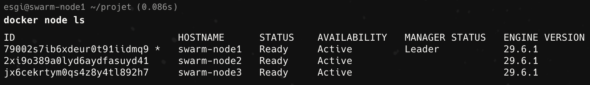

---

## 5. Transfert du projet

Depuis la machine d'administration :

```bash
cd <racine-du-projet>
tar czf - --exclude node_modules --exclude .git --exclude dist . \
  | ssh esgi@192.168.64.17 'mkdir -p ~/projet && tar xzf - -C ~/projet'
```

`rsync` n'est pas installé sur une Debian serveur minimale, d'où l'usage de
`tar` sur SSH.

---

## 6. Construction des images

Sur `swarm-node1` :

```bash
cd ~/projet
docker build -t ecommerce/auth-service:local services/auth-service
docker build -t ecommerce/product-service:local services/product-service
docker build -t ecommerce/order-service:local services/order-service
docker build -t ecommerce/frontend:local frontend
docker pull mongo:4.4.18
docker pull nginx:alpine
docker images
```

Compter une vingtaine de minutes. Le frontend est le plus long : il installe
l'ensemble des dépendances, Vite étant une dépendance de développement
nécessaire à la production du dossier `dist/`.

---

## 7. Diffusion des images vers les workers

`docker stack deploy` ne construit pas les images : chaque nœud doit disposer
localement de celles qu'il exécutera.

Depuis `swarm-node1` :

```bash
for img in auth-service product-service order-service frontend; do
  docker save ecommerce/$img:local | ssh esgi@192.168.64.18 'docker load'
  docker save ecommerce/$img:local | ssh esgi@192.168.64.19 'docker load'
done

docker save nginx:alpine | ssh esgi@192.168.64.18 'docker load'
docker save nginx:alpine | ssh esgi@192.168.64.19 'docker load'
```

MongoDB n'est pas diffusé : une contrainte de placement le fixe sur
`swarm-node1`.

Vérification :

```bash
ssh esgi@192.168.64.18 'docker images | grep ecommerce'
ssh esgi@192.168.64.19 'docker images | grep ecommerce'
```

Quatre images sur chaque worker, avec des identifiants identiques à ceux de
`swarm-node1`.

---

## 8. Génération du certificat TLS

Le service Nginx référence le certificat au moment du déploiement : il doit
donc exister au préalable.

Sur `swarm-node1` :

```bash
cd ~/projet
mkdir -p nginx/certs
openssl req -x509 -nodes -days 365 -newkey rsa:2048 \
  -keyout nginx/certs/app.local.key \
  -out nginx/certs/app.local.crt \
  -subj "/C=FR/ST=Pays-de-la-Loire/L=Nantes/O=ESGI/CN=app.local" \
  -addext "subjectAltName=DNS:app.local"
```

Le `subjectAltName` est indispensable : les navigateurs modernes ignorent le
champ `CN` et rejettent un certificat qui en est dépourvu.

Nginx assure la terminaison TLS. Le trafic entre le proxy et le frontend
reste en HTTP à l'intérieur du réseau overlay, qui n'est pas exposé.
Le port `80` ne sert qu'à rediriger vers HTTPS.

> Conformément au sujet, HTTPS a été mis en place en dernier, une fois
> l'application validée en HTTP. Cette section est présentée avant le
> déploiement car le certificat doit exister pour que la stack finale
> démarre.

---

## 9. Déploiement de la stack

Sur `swarm-node1` :

```bash
cd ~/projet
docker stack deploy -c docker-compose.prod.yml e-commerce
```

Attendre la convergence, puis :

```bash
docker stack services e-commerce
```

Résultat attendu :

```text
e-commerce_mongodb           1/1
e-commerce_auth-service      2/2
e-commerce_product-service   2/2
e-commerce_order-service     2/2
e-commerce_frontend          3/3
e-commerce_nginx             2/2   *:80->80/tcp, *:443->443/tcp
```

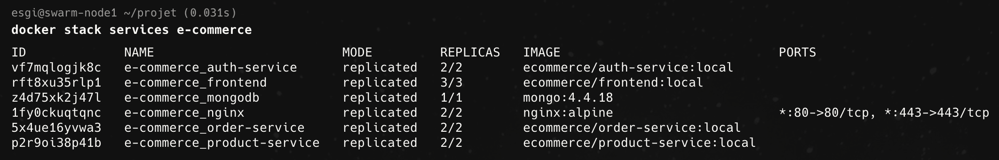

Voir des réplicas à `0/n` dans les premières secondes est normal : MongoDB
doit démarrer avant que les backends établissent leur connexion.

Répartition des tâches sur le cluster :

```bash
docker service ps e-commerce_frontend
```

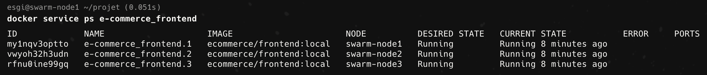

---

## 10. Initialisation et validation

Ajouter l'entrée correspondante dans le fichier `hosts` de la machine
d'administration :

```text
192.168.64.17   app.local
```

Puis :

```bash
curl -k https://app.local/health
curl -I http://app.local
PRODUCT_API_URL=https://app.local/api ./scripts/init-products.sh
curl -k https://app.local/api/products
```

L'option `-k` accepte le certificat auto-signé. La requête sur le port `80`
doit renvoyer un `301` accompagné d'un en-tête `Location` pointant vers
HTTPS.

Le script d'initialisation est idempotent : relancé, il affiche `[SKIP]` pour
les produits déjà présents.

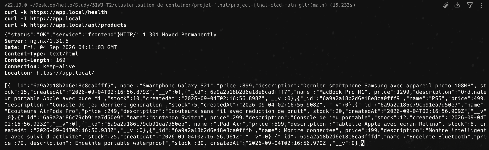

Application accessible sur `https://app.local`.

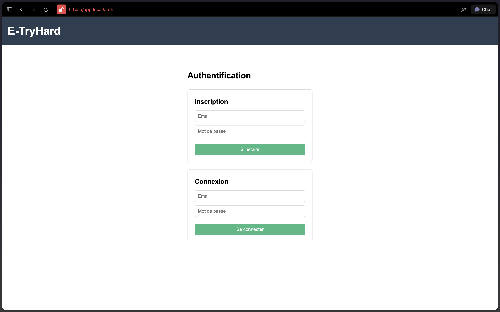

L'avertissement de sécurité affiché par le navigateur est attendu : le
certificat est auto-signé et n'est donc reconnu par aucune autorité de
certification. Le sujet autorise explicitement ce mode pour un déploiement
local sans domaine public.

---

## 11. Tests de haute disponibilité

### Mise à l'échelle

```bash
docker service scale e-commerce_frontend=5
docker service ps e-commerce_frontend
docker service scale e-commerce_frontend=3
```

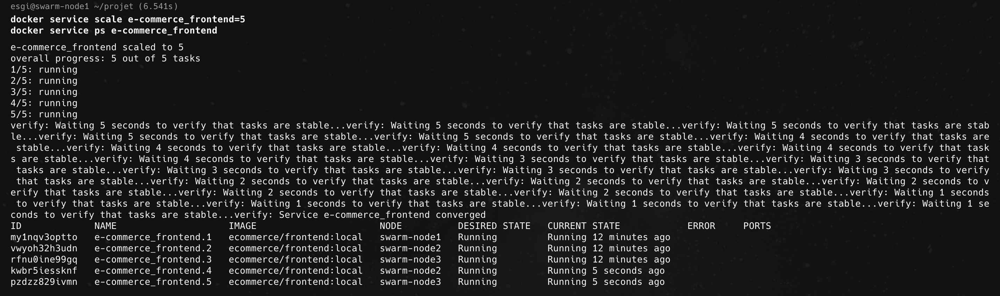

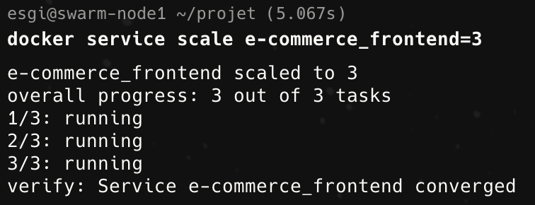

### Tolérance aux pannes

```bash
docker rm -f $(docker ps --filter name=e-commerce_auth-service -q | head -1)
sleep 20
docker service ps e-commerce_auth-service
```

Swarm marque la tâche détruite en `Failed` (`non-zero exit (137)`) et en
planifie immédiatement une nouvelle. Le second réplica continue de servir
pendant la reprise.

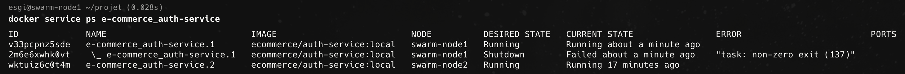

### Persistance des données

```bash
docker rm -f $(docker ps --filter name=e-commerce_mongodb -q)
sleep 30
docker service ps e-commerce_mongodb
curl -k https://app.local/api/products
```

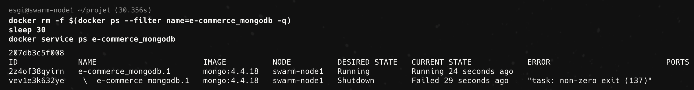

Les produits sont restitués avec leurs identifiants et horodatages
d'origine : le volume `mongodb_data` a survécu à la destruction du
conteneur.

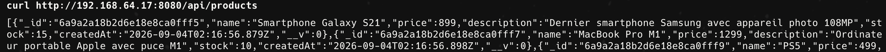

---

## 12. Gestion des secrets

Le secret de signature JWT ne figure pas dans les fichiers versionnés. Il est
stocké dans le Raft chiffré du cluster et monté dans les conteneurs par
Docker Swarm.

Création sur `swarm-node1` :

```bash
printf 'JWT_SECRET=%s\n' "$(openssl rand -hex 32)" | docker secret create app_env -
docker secret ls
```

Déclaration dans la stack, pour chacun des trois backends :

```yaml
    secrets:
      - source: app_env
        target: /run/secrets/app.env
```

Et en fin de fichier :

```yaml
secrets:
  app_env:
    external: true
```

Côté applicatif, `src/config/runtime.js` charge le fichier monté avant le
`.env` local :

```js
dotenv.config({ path: '/run/secrets/app.env' });
dotenv.config();
```

Le reste du code reste inchangé : `process.env.JWT_SECRET` est alimenté par
le secret en production, et par le `.env` en développement local.

### Vérification

Le secret n'apparaît plus dans la définition du service :

```bash
docker service inspect e-commerce_auth-service \
  --format '{{json .Spec.TaskTemplate.ContainerSpec.Env}}'
```

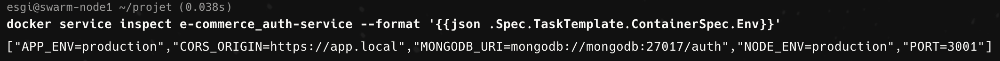

---

## 13. Exploitation courante

```bash
docker stack services e-commerce
docker service ps --no-trunc e-commerce_<service>
docker service logs --tail=100 e-commerce_<service>
```

### Modifier la configuration Nginx

Les objets `config` de Swarm sont immuables. Toute modification de
`nginx.conf` ou des certificats impose de supprimer le service et les configs
avant de redéployer :

```bash
docker service rm e-commerce_nginx
docker config rm e-commerce_nginx_conf
docker stack deploy -c docker-compose.prod.yml e-commerce
```

En production, la pratique est de versionner le nom de la config
(`nginx_conf_v2`) afin de permettre un rolling update et un retour arrière.

### Supprimer la stack

```bash
docker stack rm e-commerce
```

Le volume `mongodb_data` survit à la suppression de la stack. Le supprimer
efface définitivement les données :

```bash
docker volume rm e-commerce_mongodb_data
```